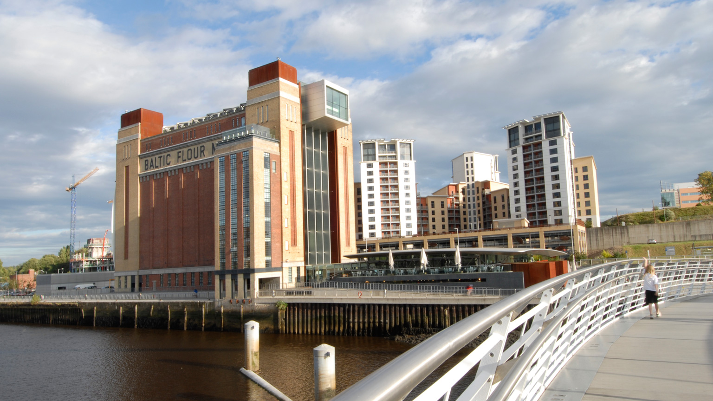
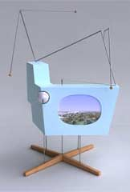
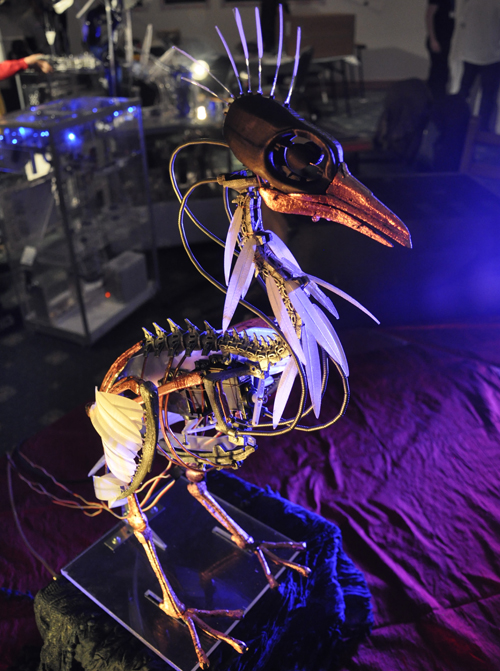

#Creative Play in Public Spaces
##Shearer - LiSC talk - February 2014

##Structure

- *humanaquarium*
- nightingallery
- play vs. games
- games as a route to creativity

##*humanaquarium*

- exploring how interactive technologies can mediate participants’ encounters and collaborations with live musicians

##Designing From Within

- An experience-based approach to designing collaborative interactive performance

- explored public interaction with digital technology through the practice-based inquiry of an inter-disciplinary team of interaction designers and musicians

- [http://humanaquarium.org/CHI2011_humanaquariumfinalv2.pdf](http://humanaquarium.org/CHI2011_humanaquariumfinalv2.pdf)

##Designing From Within 2

- literally situating the designers within the performance/use space
- assuming the roles both of performers and of designers

###*humanaquarium* was developed & refined over a year's worth of public performances (2009-2011)
  - CHI Interactivity Special Performances, Vancouver
  - The User in Flux, Intersections Digital Studios, Emily Carr
  - Jam 45, Culture Lab, Newcastle upon Tyne
  - ACM Interactive Tabletops and Surfaces, Saarbrucken
  - BBC Free Thinking Festival, Sage Gateshead, Gateshead
  - interspace2010, Banff Centre, Banff
  - Webdesign International Festival, Limoges
  - Maker Faire UK, Newcastle upon Tyne
  - Centre for Life, Newcastle upon Tyne
  - Culture Lab Relaunch, Newcastle upon Tyne
  - Dove Marine Laboratory, Newcastle upon Tyne
  - Public Announcement, Dance City, Newcastle upon Tyne

###The starting point

 - The Baltic Centre for Contemporary Art

###The Baltic Centre for Contemporary Art

- a large public gallery with a constantly changing programme of exhibitions

- observation that:
  - the exhibition curators are left to live with the artworks
  - often spending up to eight hours a day in their company

###Lived-with experience

- this long-term relationship with the art leads to a gradual process of discovery over the life of the exhibition, which may last up to several months

- deeper level of details often emerge over time as conceptual and linguistic connections are untangled and made sense of

###co-experiencing the works

- usually, these leaps in understanding occur in the course of discussion, co-experiencing the works with visitors and other staff

###Research in the wild

- research practice stems from our awareness that investigating human experience in the laboratory is necessarily exclusive of many of the contextual factors found in real world environments

###Practice Echoes

- this practice echoes approaches such as:
  - Gaver et al.'s long-term installations of unique technologies into people's homes
  - Wallace's crafting of bespoke jewellery pieces for individual subjects
- situated outside the laboratory, allowing a genuine interrogation of the cultural context under investigation

###*humanaquarium* in action

<iframe width="640" height="360" src="//www.youtube.com/embed/AlE-bGH3_q0?feature=player_detailpage&v=AlE-bGH3_q0#t=88" frameborder="0" allowfullscreen></iframe>

###Reflections

- we started considering the experiences of curatorial  staff living with artworks over extended periods of time
- the voice that was always missing from this conversation was that of the creator him/herself

- *designing from within* is in contrast with Gaver's cultural commentators or Hook et al's use of documentary as an investigatory tool
  - both which use an outsider's account of a design and then communicate it back to the designer

- situating ourselves within the design and taking the role of performer during the humanaquarium performance allowed
  - first-hand experience
  - simultaneous dialogical exchange with users
  - leading to a number of insights that may have been overlooked in a traditional design process

###Insights

- A tension emerged between:
  - our instincts and desires as musicians to make more complex and (to us) more satisfying musical pieces
  - and the necessity to retain a simplicity and transparency in our compositions
    - to allow passing viewers to instantly collaborate with us

##Nightingallery

###Starting point

###Research practice

- part of a research practice that explores social behaviour in public performance spaces through the enactment and examination of interactive, performance-based artworks

##Play vs Games

- in

##Games as a route to Creativity

- gamification = blurgh
